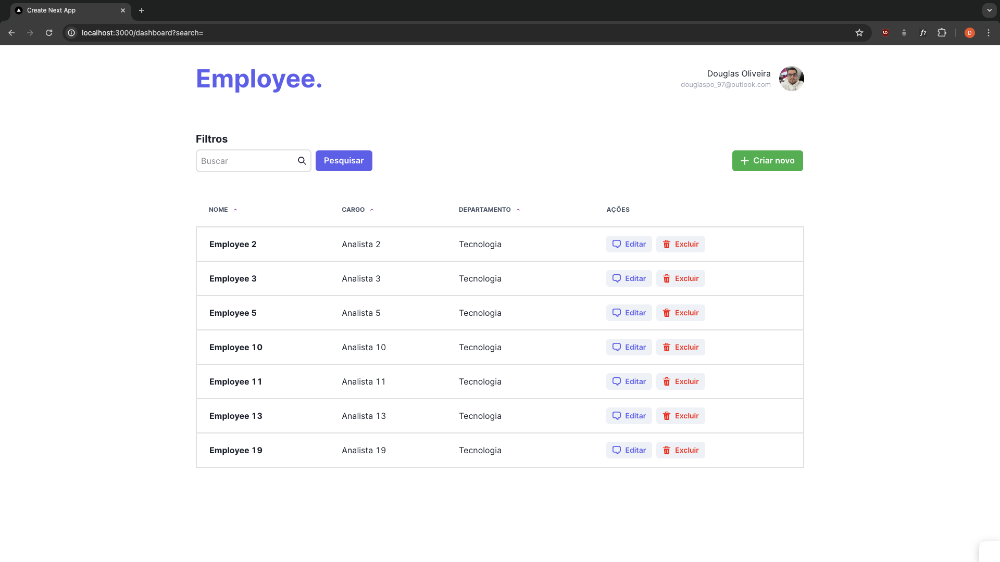

<h1 align="center">
    
</h1>

# Employee Dashboard

Esse projeto foi desenvolvido como desafio técnico para uma oportunidade de Desenvolvedor Full Stack. A aplicação foi desenvolvida do completo zero, sendo um dashboard simples para manutenção de funcionários, permitindo ao usuário realizar operações de CRUD (create, read, update e delete). A príncipio não foi feita a implementação da autenticação no front-end, porém o back-end já possui as entidades, rotas e lógicas criadas.

## Tech Stack

## Getting Started

1. **Create containers**: `docker compose up -d`
2. **Install dependencies in both folders (back e front)**: `npm install or yarn`
3. **Run back-end(inside back-end folder)**: `npm run dev or yarn dev`
4. **Run front-end(inside front-end folder)**: `npm run dev or yarn dev`

## License

This software is available under the following licenses:

- [MIT](https://rem.mit-license.org)
